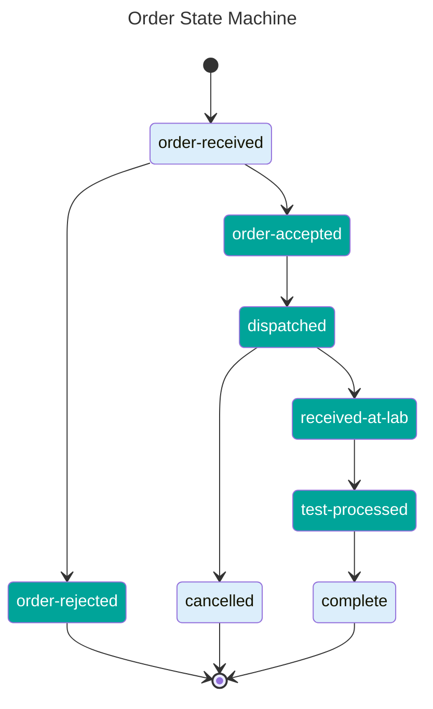

# Status Transitions (FHIR Task.status)

**Allowed business statuses:**

- `order-received`
- `order-accepted`
- `order-rejected`
- `dispatched`
- `cancelled`
- `received-at-lab`
- `test-processed`
- `complete`

## Allowed Transitions
The following state machine shows the allowed transitions for HomeTest orders.

The states in green are states that are controlled by the suppliers - i.e. the entry to that state comes from an update from the supplier.

The states in blue are states that are contolled within HomeTest.

## Order Creation and Completion

New orders are only created within the HomeTest platform.

Orders can only be marked as 'complete' by the HomeTest platform, usually on receipt of a test result update from the test supplier.

This means that while `order-received`, `cancelled` and `complete` are valid order statuses, they shouldn't be sent as order updates by suppliers. Only the status of `order-accepted`, `order-rejected`, `dispatched`, `received-at-lab` and `test processed` should be sent by test suppliers (marked in green on the diagram above)

## Order Acceptance and Rejection
Orders are accepted or rejected by the suppliers asychronously. This means that orders that are at `order-received` are submitted to the suppliers, and HomeTest then waits for an update from the test supplier, expecting either `order-accepted` or `order-rejected`.

Once an order has been accepted by a supplier, the order must then move through to `dispatched`, and it cannot be later cancelled by the test supplier.

## Order Cancellation
Users can cancel an order only when it is in the `dispatched` state.

## Rules

1. **Monotonic progression**: transitions **MUST** move forward only.
2. **Idempotent updates**: re-sending the same status is allowed and **MUST NOT** error.
3. **No skips**: skipping intermediate states is **SHOULD NOT**. If a supplier cannot emit all states, they **MUST** document and obtain approval.
4. **Terminal**: `order-rejected`, `cancelled` and `complete` are terminal states; no further transitions allowed. No updates to results using `POST /result` are permitted in these states.

## Error Semantics

- Invalid backward transition: return `409 Conflict` with `OperationOutcome` (code `business-rule`) detailing attempted transition.
- Unknown `status`: return `422 Unprocessable Entity` with details.
