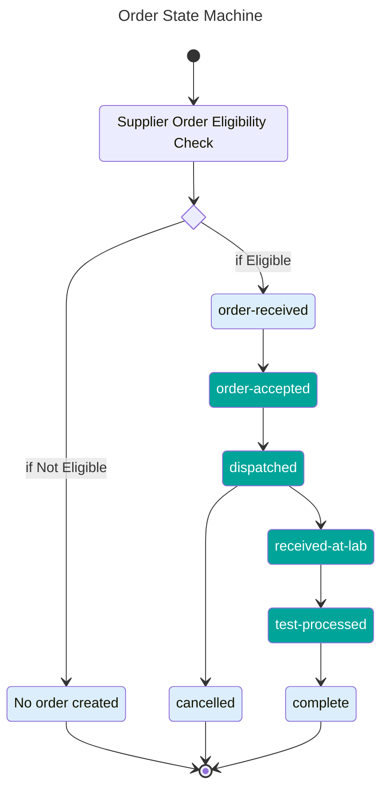

# Status Transitions (FHIR Task.status)

**Allowed business statuses:**

- `order-received`
- `order-accepted`
- `dispatched`
- `cancelled`
- `received-at-lab`
- `test-processed`
- `complete`

## Allowed Transitions

The following state machine shows the allowed transitions for HomeTest orders.

The states in green are states that are controlled by the suppliers - i.e. the entry to that state comes from an update from the supplier.

The states in blue are states that are controlled within HomeTest.

## Order Creation and Completion

New orders are only created within the HomeTest platform.

Orders can only be marked as 'complete' by the HomeTest platform, usually on receipt of a test result update from the test supplier.

This means that while `order-received`, `cancelled` and `complete` are valid order statuses, they shouldn't be sent as order updates by suppliers. Only the status of `order-accepted`, `dispatched`, `received-at-lab` and `test-processed` should be sent by test suppliers (marked in green on the diagram above)

## Order Acceptance and Rejection

Before an order is formally created, a 'draft' order is sent to the supplier. This known as the 'Supplier Order Eligibility Check', and is the moment where a supplier decides whether to accept to reject the order.

If an order is rejected in the supplier eligibility check, a HomeTest order is not created, and the user is directed to other avenues. For example, this is a direction to the user's closest sexual health clinic for HIV tests.

If the order is accepted through the supplier eligibility check, the order is sent to the supplier and must then move through to `dispatched`, and it cannot be later cancelled by the test supplier. In other words, a test kit MUST be dispatched if the eligibility check has passed successfully.

## Order Cancellation

Users can cancel an order only when it is in the `dispatched` state.
Further updates to a 'cancelled' order are rejected by HomeTest, and an error is raised. Results for cancelled orders not currently handled by the HomeTest API, and are also rejected if they're received for a cancelled order.

## Rules

1. **Monotonic progression**: transitions **MUST** move forward only.
2. **Idempotent updates**: re-sending the same status is allowed and **MUST NOT** error.
3. **No skips**: skipping intermediate states is **SHOULD NOT**. If a supplier cannot emit all states, they **MUST** document and obtain approval.
4. **Terminal**: `order-rejected`, `cancelled` and `complete` are terminal states; no further transitions allowed. No updates to results using `POST /result` are permitted in these states.

## Error Semantics

- Invalid backward transition: return `409 Conflict` with `OperationOutcome` (code `business-rule`) detailing attempted transition.
- Unknown `status`: return `422 Unprocessable Entity` with details.
